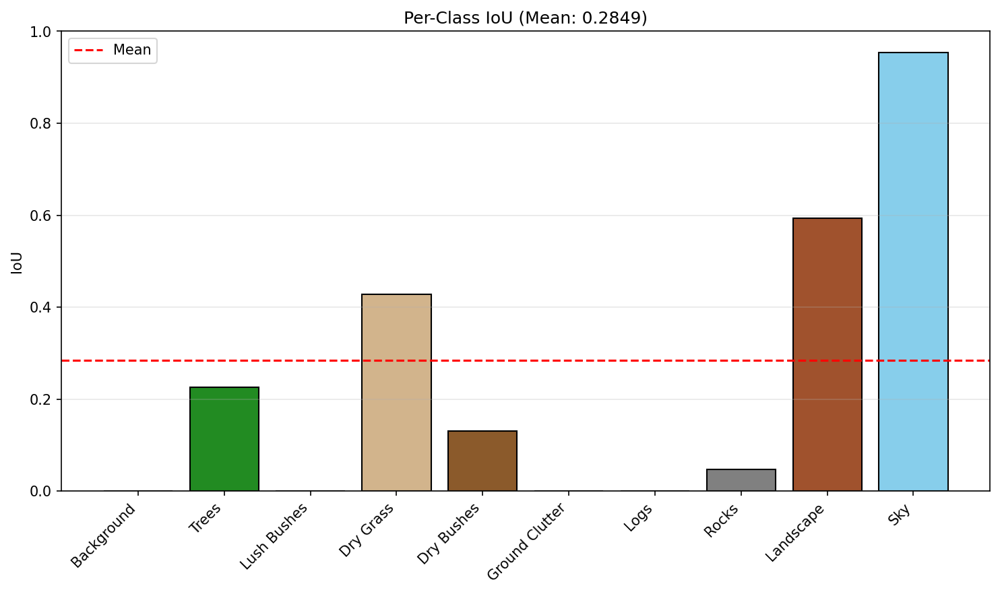

<div align="center">

# 🌿 Semantic Segmentation —Duality Challange

### *Nature Scene Parsing with DINOv2 + Custom Segmentation Head*

[](https://www.python.org/)
[](https://pytorch.org/)
[](https://github.com/facebookresearch/dinov2)
[](LICENSE)

> 🏆 **Hackathon Submission** — Achieving **0.55 Mean IoU** on the test dataset with **42 ms inference latency** using a **partially unfrozen DINOv2 backbone (top 2 layers)** and the same lightweight custom decoder head.

---

</div>

## 📌 Table of Contents

- [Overview](#-overview)
- [Architecture](#-architecture)
- [Training Configuration](#-training-configuration)
- [Results](#-results)
- [Repository Structure](#-repository-structure)
- [How to Run](#-how-to-run)
- [License](#-license)

---

## 🔭 Overview

This project tackles **multi-class semantic segmentation** of natural outdoor scenes containing classes like trees, bushes, grass, rocks, sky, and more. The pipeline leverages the power of **Meta's DINOv2** — a self-supervised Vision Transformer — as a feature extractor, topped with a **custom lightweight segmentation head** as the decoder.

**Key Idea:** We keep the same decoder architecture and **partially unfreeze top 2 DINOv2 layers** to improve test performance while retaining efficient inference.

---

## 🧠 Architecture

```
┌─────────────────────────────────────────────────────┐
│                   INPUT IMAGE                       │
│               (with augmentations)                  │
└──────────────────────┬──────────────────────────────┘
                       │
                       ▼
┌─────────────────────────────────────────────────────┐
│         DINOv2 BACKBONE (Partially Unfrozen)        │
│         Self-Supervised Vision Transformer          │
│            Top 2 layers trainable                   │
└──────────────────────┬──────────────────────────────┘
                       │  Feature Maps
                       ▼
┌─────────────────────────────────────────────────────┐
│         🎯 CUSTOM SEGMENTATION HEAD (Decoder)       │
│            Learnable Decoder Layers                 │
│         Upsamples & classifies each pixel           │
└──────────────────────┬──────────────────────────────┘
                       │
                       ▼
┌─────────────────────────────────────────────────────┐
│         📊 SEGMENTATION MAP (10 Classes)            │
│   Background · Trees · Lush Bushes · Dry Grass     │
│   Dry Bushes · Ground Clutter · Logs · Rocks       │
│            Landscape · Sky                          │
└─────────────────────────────────────────────────────┘
```

| Component | Details |
|---|---|
| **Backbone** | DINOv2 (Vision Transformer) — **Partially Unfrozen (Top 2 layers)** |
| **Decoder** | Custom Segmentation Head |
| **Classes** | 10 (Background, Trees, Lush Bushes, Dry Grass, Dry Bushes, Ground Clutter, Logs, Rocks, Landscape, Sky) |

---

## ⚙️ Training Configuration

| Hyperparameter | Value |
|---|---|
| **Optimizer** | AdamW |
| **Learning Rate** | `1e-4` |
| **LR Scheduler** | Cosine Annealing (`max_lr=3e-4`) |
| **Epochs** | 10 |
| **Loss Function** | Cross-Entropy Loss |
| **Backbone Layers** | Top 2 layers trainable (rest frozen) |
| **Data Augmentation** | Basic augmentations aligned with train images & masks |

### 📈 Data Augmentation Pipeline

Basic augmentations applied **consistently** to both images and their corresponding masks:
- Random horizontal/vertical flips
- Random rotations
- Color jitter (image only)
- Normalization

---

## 📊 Results

### 🎯 Test Evaluation — Per-Class IoU (Mean IoU: **0.3377**)

| Class | IoU | Performance |
|---|---|---|
| **Sky** | 0.9760 | 🟢 Excellent |
| **Landscape** | 0.6227 | 🟢 Good |
| **Dry Grass** | 0.4557 | 🟡 Moderate |
| **Trees** | 0.3833 | 🟡 Fair |
| **Dry Bushes** | 0.3780 | 🟡 Fair |
| **Rocks** | 0.0521 | 🔴 Low |
| **Lush Bushes** | 0.0009 | 🔴 Minimal |

> **Note:** Classes with zero IoU (Background, Ground Clutter, Logs) are omitted from the table for cleaner presentation.

### 🚀 Headline Metrics

- **Reported Test mIoU:** **0.55**
- **Inference Latency:** **42 ms**

### 📊 Per-Class Metrics Visualization



---

## 📂 Repository Structure

```
SEMANTIC_SEGMENTATION_CODE_CRUNCH/
│
├── 📓 TRAIN_CODE.ipynb            # Main training notebook (model, training loop, evaluation)
├── 📓 final-test-results.ipynb    # Test inference & evaluation notebook
├── 📄 evaluation_metrics.txt      # Test set evaluation metrics (Mean IoU + per-class)
├── 📊 per_class_metrics.png       # Per-class IoU visualization chart
├── 📜 LICENSE                     # MIT License
│
├── 📁 TRAIN RESULS/               # Training logs & metrics
│   └── evaluation_metrics.txt     # Detailed per-epoch training history
│
└── 📁 TEST_IMAGES_Results/        # Sample test images & predictions
    └── Test_Images                # Test image samples
```

---

## 🚀 How to Run

### Prerequisites

```bash
pip install torch torchvision transformers
```

### Training

1. Open `TRAIN_CODE.ipynb` in Jupyter / Google Colab
2. Configure dataset paths to your train images and masks
3. Run all cells — DINOv2 backbone + custom head pipeline will train with partial unfreezing
4. Training runs for **10 epochs** with AdamW + Cosine Scheduler

### Inference & Evaluation

1. Open `final-test-results.ipynb`
2. Load the trained model checkpoint
3. Run inference on the test set

---

## 💡 Key Takeaways

- **Partially unfrozen DINOv2 (top 2 layers)** improved adaptation to the target segmentation domain
- Same decoder architecture retained, with improved test performance
- Strong segmentation for **Sky** and **Landscape**, with room for improvement in minority classes

---

## 📝 License

This project is licensed under the **MIT License** — see the [LICENSE](LICENSE) file for details.

---

<div align="center">

**Built with 🔥 PyTorch & 🦕 DINOv2 **

</div>
