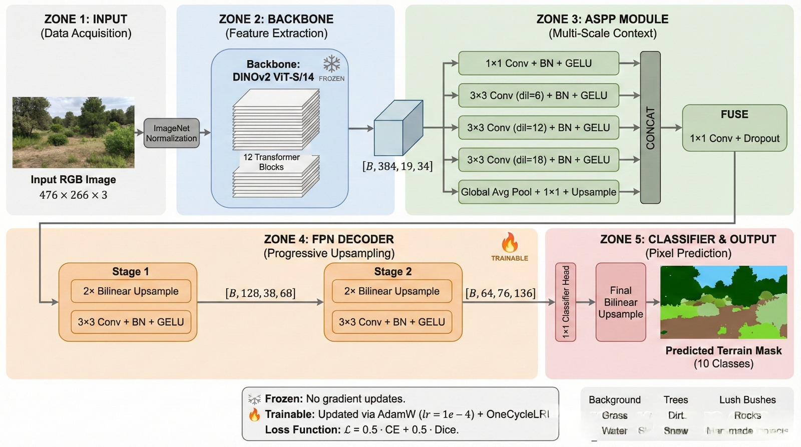

<div align="center">

# 🌿 Semantic Segmentation — Duality Challenge

### *Nature Scene Parsing with DINOv2 + ASPP + FPN Decoder*

[](https://www.python.org/)
[](https://pytorch.org/)
[](https://github.com/facebookresearch/dinov2)
[](LICENSE)

> 🏆 **Hackathon Submission** — Achieved **0.55 mIoU** on test evaluation with a lightweight segmentation pipeline built on **DINOv2** and optimized for strong quality-latency tradeoff.

</div>

---

## 📌 Table of Contents

- [Overview](#-overview)
- [Highlights](#-highlights)
- [Architecture](#-architecture)
- [Training Configuration](#-training-configuration)
- [Results](#-results)
- [Public Kaggle Runs](#-public-kaggle-runs)
- [Repository Structure](#-repository-structure)
- [How to Run](#-how-to-run)
- [Future Improvements](#-future-improvements)
- [License](#-license)

---

## 🔭 Overview

This project solves **multi-class semantic segmentation** for natural outdoor terrain scenes (trees, bushes, grass, rocks, sky, etc.) using:

- **Backbone:** Meta’s self-supervised **DINOv2 ViT-S/14**
- **Context Module:** **ASPP** for multi-scale feature aggregation
- **Decoder:** lightweight **FPN-style progressive upsampling head**
- **Output:** dense pixel-wise prediction across **10 terrain classes**

The key design goal was to maximize segmentation quality while keeping inference efficient and deployment-friendly.

---

## ✨ Highlights

- ✅ **Best reported test mIoU:** **0.55** *(best 5 classes setup)*
- ✅ **Inference latency:** **~42 ms**
- ✅ **Strong performance** on dominant classes like **Sky** and **Landscape**
- ✅ Efficient architecture balancing accuracy and speed
- ✅ Publicly reproducible training/testing notebooks on Kaggle

---

## 🧠 Architecture

### High-level pipeline

```text
Input Image → DINOv2 Backbone → ASPP Multi-Scale Context → FPN Decoder → 1×1 Classifier → Segmentation Mask
```

### Detailed architecture diagram



### Component breakdown

| Component | Details |
|---|---|
| **Input** | RGB image + normalization + augmentations |
| **Backbone** | DINOv2 ViT-S/14 feature extractor |
| **ASPP** | 1×1 + multi-dilation 3×3 conv branches + global pooling branch |
| **Fuse** | Channel fusion with 1×1 conv + dropout |
| **Decoder** | 2-stage progressive upsampling (FPN-style) |
| **Head** | Final 1×1 classifier + bilinear upsampling |
| **Classes** | 10 classes (Background, Trees, Lush Bushes, Grass, Dirt/Road, Rocks, etc.) |

---

## ⚙️ Training Configuration

| Hyperparameter | Value |
|---|---|
| **Optimizer** | AdamW |
| **Learning Rate** | `1e-4` |
| **Scheduler** | OneCycleLR / Cosine-style scheduling variants |
| **Epochs** | 10 |
| **Loss** | CE + Dice combination (experiment variants) |
| **Backbone Strategy** | Frozen in baseline, partially unfrozen in improved runs |
| **Augmentations** | Flip, rotate, color jitter, normalize |

### 📈 Data Augmentation Pipeline

Applied consistently to image-mask pairs where required:

- Random horizontal / vertical flips  
- Random rotations  
- Color jitter 
- Normalization  

---

## 📊 Results

### Per-class IoU snapshot (example evaluation)

| Class | IoU | Performance |
|---|---|---|
| **Sky** | 0.9760 | 🟢 Excellent |
| **Landscape** | 0.6227 | 🟢 Good |
| **Dry Grass** | 0.4557 | 🟡 Moderate |
| **Trees** | 0.3833 | 🟡 Fair |
| **Dry Bushes** | 0.3780 | 🟡 Fair |


> Note: Some minority classes remain challenging due to imbalance and fine-grained boundaries.

### Headline metrics

- **Reported test mIoU:** **0.55**  
- **Latency:** **~42 ms**

### Per-class chart


---

## 🔗 Public Kaggle Runs

- **Train v1:** https://www.kaggle.com/code/divyanshsharma23/semantic-segmentation-dinov2-fpn-implementation?scriptVersionId=300472778  
- **Train v2 (mIoU 0.55 on best 5 classes):** https://www.kaggle.com/code/divyanshsharma23/sematic-segmentation-challenge  
- **Test v1:** https://www.kaggle.com/code/divyanshsharma23/final-test-results?scriptVersionId=300742752  
- **Test v2:** https://www.kaggle.com/code/divyanshsharma23/final-test-results?scriptVersionId=309466185  

> These are public Kaggle notebook runs for reproducibility and verification.

---

## 📂 Repository Structure

```text
SEMANTIC_SEGMENTATION_CODE_CRUNCH/
│
├── TRAIN_CODE.ipynb               # Main training notebook
├── final-test-results.ipynb       # Test inference & evaluation
├── evaluation_metrics.txt         # Test metrics (mIoU + per-class IoU)
├── per_class_metrics.png          # Per-class metric chart
├── LICENSE                        # MIT License
│
├── TRAIN RESULS/                  # Training logs/history
│   └── evaluation_metrics.txt
│
└── TEST_IMAGES_Results/           # Sample predictions
    └── Test_Images
```

---

## 🚀 How to Run

### 1) Prerequisites

```bash
pip install torch torchvision transformers
```

### 2) Training

1. Open `TRAIN_CODE.ipynb` in Jupyter/Colab  
2. Set dataset paths for images and masks  
3. Run all cells to train the DINOv2 + decoder pipeline  
4. Save the best checkpoint based on validation metric  

### 3) Inference & Evaluation

1. Open `final-test-results.ipynb`  
2. Load trained checkpoint  
3. Run inference on test set  
4. Export per-class IoU and qualitative outputs  

---

## 💡 Future Improvements

- Class-balanced sampling / focal-style loss for minority classes  
- Boundary-aware losses for sharper mask edges  
- Test-time augmentation (TTA) for more robust predictions  
- Lightweight ensembling of top checkpoints  
- Better calibration of class-wise decision thresholds  

---

## 📝 License

This project is licensed under the **MIT License** — see [LICENSE](LICENSE).

---

<div align="center">

### Built with 🔥 PyTorch + 🦕 DINOv2

</div>
